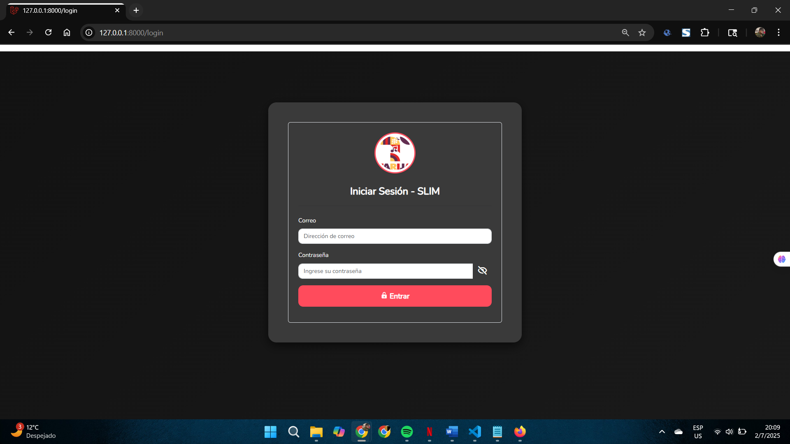
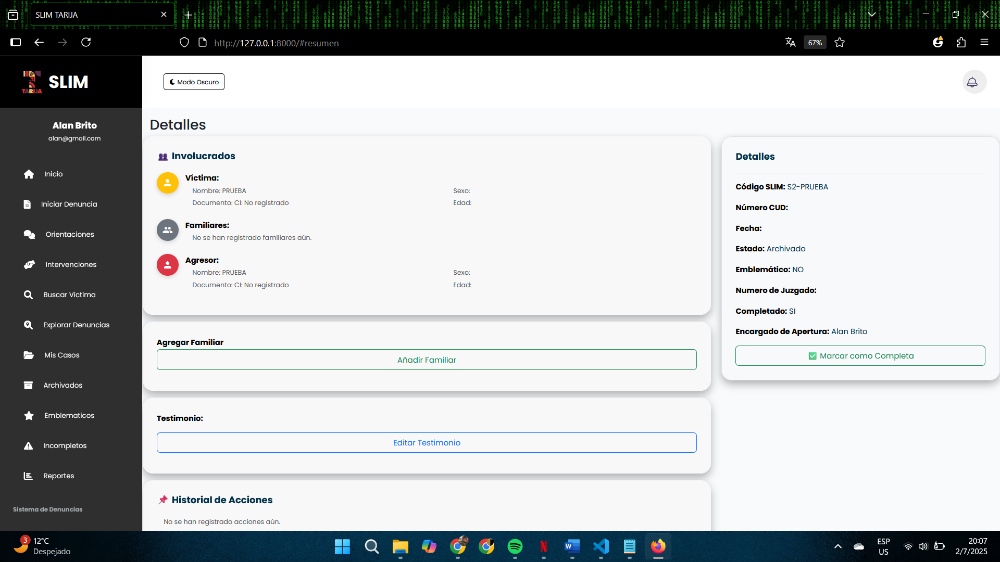
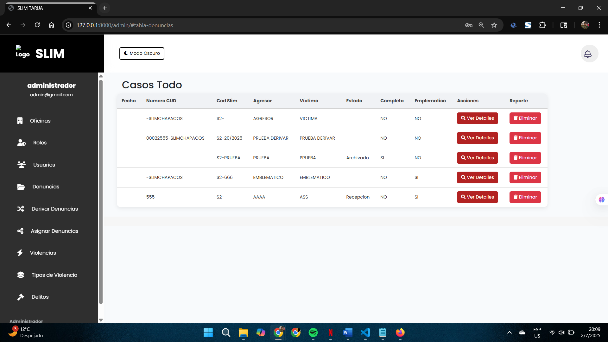

<p align="center">
  <a href="https://laravel.com" target="_blank">
    
  </a>
</p>

## 📌 Sistema de Gestión de Denuncias – Defensoría SLIM

Aplicación web desarrollada con Laravel que permite registrar, administrar y hacer seguimiento de denuncias o procesos, facilitando la labor del personal mediante una plataforma segura y escalable.

## ⚙️ Requisitos del sistema

- PHP ≥ 8.0  
- Composer  
- MySQL (u otro motor compatible con Laravel)  
- Extensiones PHP necesarias: `openssl`, `pdo`, `mbstring`, `tokenizer`, `xml`, `ctype`, `json`, `bcmath`, `fileinfo`

## 🧩 Instalación del proyecto

```bash
# Clonar el repositorio
git clone https://github.com/velardep/Gestion_Denuncias.git
cd DEFENSORIA_LARAVEL

# Instalar dependencias de PHP
composer install

# Copiar archivo de entorno
cp .env.example .env

# Generar clave de aplicación
php artisan key:generate

# Configurar .env con tus credenciales de base de datos

# Ejecutar migraciones (y seeders si existen)
php artisan migrate

# Crear enlace simbólico para almacenamiento (si se usan archivos)
php artisan storage:link

# Asignar permisos adecuados (en Linux)
chmod -R 775 storage bootstrap/cache
```

## ▶️ Ejecución en entorno local

```bash
php artisan serve
```

Abrir en el navegador: `http://127.0.0.1:8000`

## 🛠️ Comandos útiles

```bash
# Limpiar caché y configuración
php artisan optimize:clear

# Reiniciar base de datos (migraciones y seeders)
php artisan migrate:fresh --seed

# Ejecutar pruebas (si existen)
php artisan test
```

## 🧰 Tecnologías usadas

- Laravel (Framework PHP – MVC)  
- Blade, Bootstrap (Frontend)  
- PostgreSQL (Base de datos)  
- Eloquent ORM, Migraciones, Seeders  
- Validación, Autenticación, Middleware  

## 📸 Capturas de pantalla

A continuación, algunas vistas del sistema en funcionamiento:

<p align="center">
  <br>
    <em>Pantalla de inicio de sesión</em>
</p>

<p align="center">
  <br>
    <em>Formulario de detalle de denuncia</em>
</p>

<p align="center">
  <br>
    <em>Panel de administración</em>
</p>

<p align="center">
  <br>
    <em>Panel de administración</em>
</p>

## 📄 Documentación

- [Manual de Usuario (PDF)](docs/Manual_Usuario.pdf)
- [Manual de Administrador (PDF)](docs/Manual_Administrador.pdf)

## 👩‍💼 Destinado a

Personal técnico y administrativo para facilitar la gestión y trazabilidad de denuncias de violencia.

## 📄 Licencia

Este proyecto está licenciado bajo la licencia MIT.
